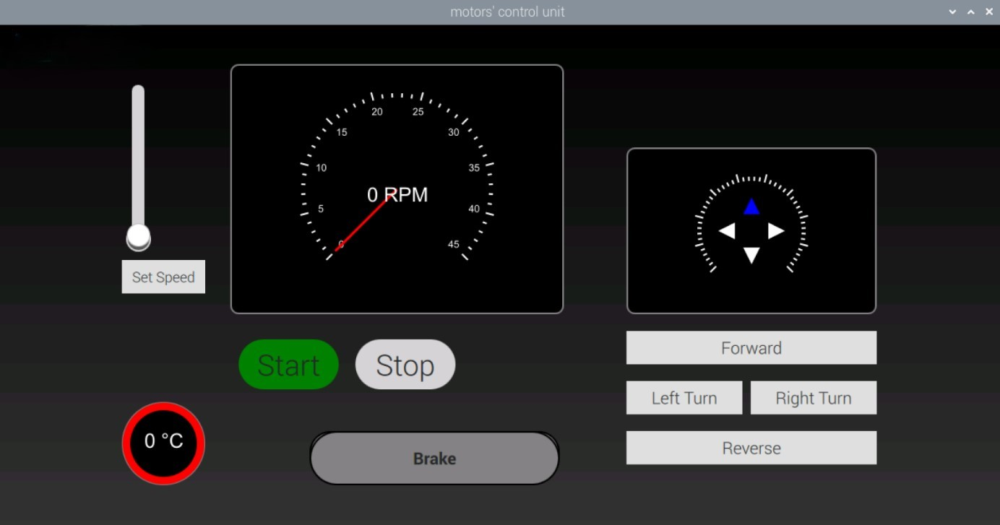
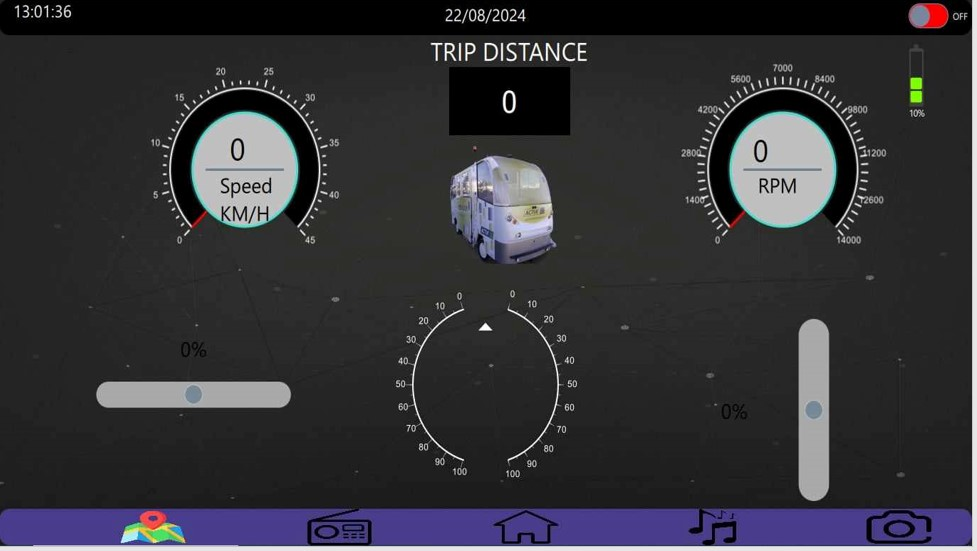

# Electric Vehicle HMI Controller

A comprehensive Human-Machine Interface (HMI) system for electric vehicle control and monitoring, built with Qt QML on Raspberry Pi 4 with STM32 integration.

## Overview

This project provides a complete control and monitoring interface for an electric vehicle's BLDC motors. The system uses a Raspberry Pi 4 running a Qt QML interface that communicates with an STM32F446 microcontroller, which handles real-time motor control via analog signals.

## Screenshots

### Original HMI Interface


### Modified HMI Interface


## Features

### Control Functions
- **Speed Control** - Variable speed adjustment for BLDC motors
- **Directional Control** - Forward and reverse operation
- **Steering Control** - Left and right steering commands
- **Motor Start/Stop** - Engine ignition control
- **Brake Function** - Emergency and normal braking

### Monitoring Capabilities
- **Motor Temperature** - Real-time thermal monitoring
- **Speed Display** - Current motor speed feedback

## System Architecture

```
┌─────────────────┐         UART          ┌──────────────┐        DAC         ┌─────────────────┐
│  Raspberry Pi 4 │ ◄──────────────────► │  STM32F446   │ ──────────────────► │ BLDC Controllers│
│   (Qt QML HMI)  │                       │  (Firmware)  │                     │                 │
└─────────────────┘                       └──────────────┘                     └─────────────────┘
         ▲                                                                               │
         │                                    CAN Bus                                    │
         └────────────────────────────────────────────────────────────────────────────┘
```

**Communication Flow:**
1. User interacts with Qt QML interface on Raspberry Pi 4
2. Commands sent to STM32F446 via UART
3. STM32 converts digital commands to analog signals via DAC
4. Analog signals control BLDC motor controllers
5. Motor feedback (temperature, speed) sent back via CAN bus to Raspberry Pi

## Hardware Requirements

- **Raspberry Pi 4** - Main computing unit running the HMI
- **STM32F446RET6** - Real-time control microcontroller
- **BLDC Motor Controllers** - Motor drivers with CAN communication
- **Display** - Connected to Raspberry Pi for Qt interface
- **Power Supply** - Appropriate for automotive application

## Software Stack

- **Qt/QML** - User interface framework
- **STM32CubeIDE** - STM32 firmware development
- **STM32 HAL** - Hardware abstraction layer
- **UART** - Raspberry Pi ↔ STM32 communication
- **DAC** - Digital-to-analog conversion for motor control
- **CAN Bus** - Motor controller feedback

## Repository Structure

```
├── qt-qml-interface/     # Qt QML HMI application
├── stm32-firmware/       # STM32F446 firmware (CubeIDE project)
└── docs/                 # Documentation and diagrams
```

## Setup Instructions

### Raspberry Pi Setup
1. Install Qt and QML dependencies on Raspberry Pi 4
2. Configure UART interface for STM32 communication
3. Set up CAN interface for motor controller feedback
4. Deploy and run the QML application

### STM32 Setup
1. Open the project in STM32CubeIDE
2. Configure UART peripheral for Raspberry Pi communication
3. Configure DAC outputs for motor control signals
4. Flash firmware to STM32F446

### Hardware Connections
- Connect Raspberry Pi UART to STM32 UART pins
- Connect STM32 DAC outputs to BLDC controller analog inputs
- Connect CAN bus from motor controllers to Raspberry Pi CAN interface

## Future Improvements

- [ ] Add battery state of charge monitoring
- [ ] Implement regenerative braking feedback
- [ ] Add data logging capabilities
- [ ] Expand diagnostics and error reporting
- [ ] Implement cruise control functionality

## License

This project is open source and available for educational purposes.

## Author

Created as part of an electric vehicle control system project.
